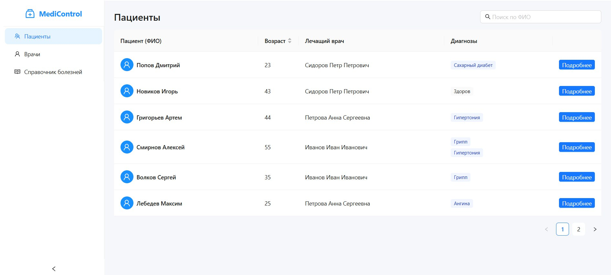
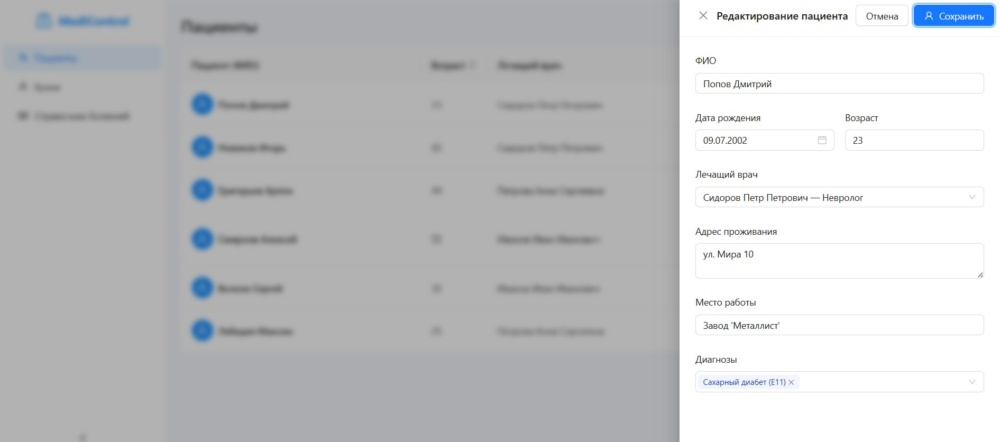
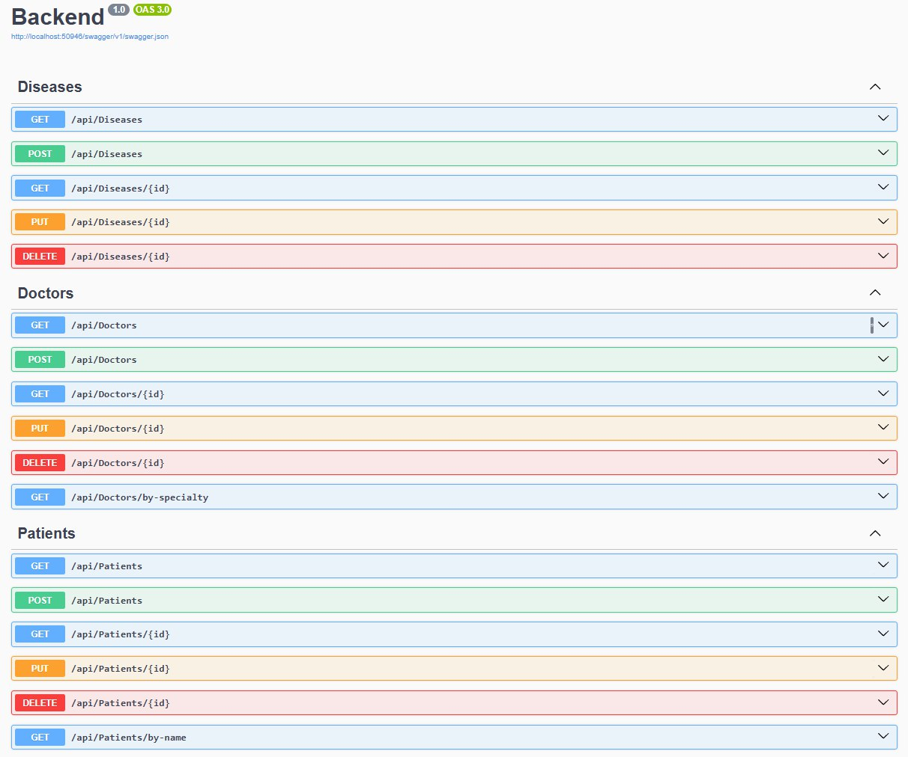

# MediControl

Комплексная система управления медицинскими записями, объединяющая учет пациентов, врачей и ведение справочника заболеваний. Проект построен на актуальном стеке .NET 9 и React, с применением .NET Aspire.

## Технологический стек

**Backend:**

  * .NET 9 (ASP.NET Core Web API)
  * Entity Framework Core
  * PostgreSQL
  * Swagger

**Frontend:**

  * React 19 (Vite)
  * TypeScript
  * Ant Design (компонентная библиотека)
  * Axios для взаимодействия с API

**Инфраструктура:**

  * .NET Aspire
  * Docker

## Архитектура данных

База данных построена на следующих сущностях:

**Doctors:** Хранит ФИО врача, его специальность, стаж и дату рождения.
*Связь:* «Один-ко-Многим» с таблицей `Patients` (у одного врача может быть список прикрепленных пациентов).

* **Patients:** Основная карточка. Содержит ФИО, адрес проживания, место работы и дату рождения.
*Связи:* «Многие-к-Одному» с таблицей `Doctors` (пациент обязательно прикреплен к одному лечащему врачу) «Многие-ко-Многим» с таблицей `Diseases` (у пациента может быть несколько диагнозов).

* **Diseases:** Справочник заболеваний. Содержит уникальный код, название и описание болезни.
*Связь:* «Многие-ко-Многим» с таблицей `Patients` (одна и та же болезнь может быть диагностирована у  разных пациентов).

## Функциональные возможности

### Backend API
Для всех основных сущностей реализован CRUD.

1.  **Пациенты:**
    * Создание, редактирование, удаление и просмотр профиля.
    * Получение списка с подгрузкой имени врача и  диагнозов.
    * Поиск по ФИО.
2.  **Врачи:**
    * Полное управление карточками врачей.
    * Фильтрация списка по специальности.
3.  **Болезни:**
    * Добавление, изменение и удаление диагнозов в справочнике.

### Frontend
* **Пациенты:** Таблица со списком пациентов. Можно искать по имени и редактировать данные.
* **Врачи:** Список специалистов с их даннными.
* **Болезни:** Справочник с кодами, названиями заболеваний, и описанием.

## Демонстрация

### Панель управления .NET Aspire

Оркестратор обеспечивает запуск и мониторинг всех узлов системы (API, Frontend, PostgreSQL).


### Интерфейс системы

Главный экран с реестром пациентов и формой поиска.


### Форма редактирования

Интерфейс изменения данных пациента.


### Swagger UI



## Локальный запуск

Для развертывания проекта требуются установленные .NET 9 SDK, Node.js и Docker Desktop.

1.  Клонирование репозитория:

    ```bash
    git clone https://github.com/EgorFedosov/MediControl
    ```

2.  Запуск Docker Desktop (необходим для поднятия контейнера PostgreSQL).

3.  Запуск через хост-проект Aspire:

    ```bash
    cd MediControl/MediControl.AppHost
    dotnet run
    ```

4.  После инициализации в консоли появится ссылка на дашборд Aspire `https://localhost:XXXXX`. Откройте её, найдите строку **frontend** и кликните по ссылке `http://localhost:XXXXX` в колонке конечные точки.

База данных будет создана и наполнена данными автоматически при первом запуске.

-----
